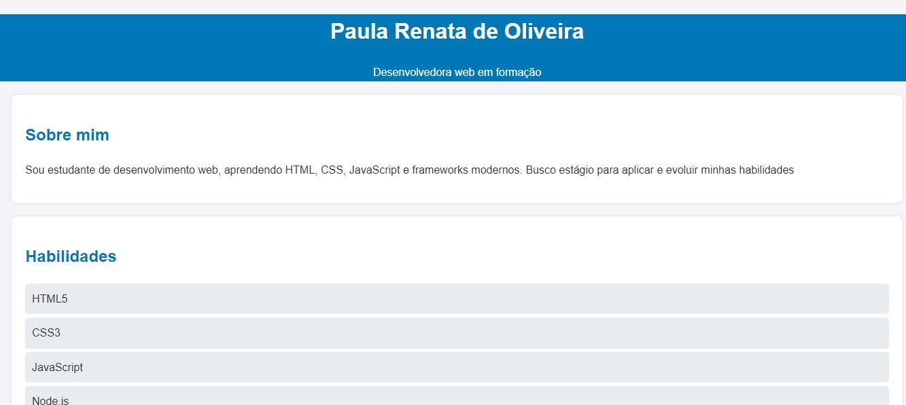

# 🌐 Portfólio Pessoal - Paula Renata de Oliveira
<p align="center">
  
</p>


Bem-vindo ao meu portfólio!
Aqui você encontra meus projetos desenvolvidos em **HTML5, CSS3 e JavaScript**, além das minhas informações de contato. 🚀

---

## 📋 Funcionalidades

- Navbar fixa com navegação entre seções.
- **Modo escuro/claro** (Dark Mode).
- Seção de apresentação com foto e resumo.
- Seção de **projetos** com cards interativos.
- Seção de contato com links diretos.
---

## Demonstração

```markdown


## 🛠️ Tecnologias Utilizadas

- **HTML5**
- **CSS3**
- **JavaScript**
- **Git e GitHub** para versionamento e hospedagem.

---

## 🚀 Como acessar

👉 Você pode acessar meu portfólio online pelo link:  
[**🔗 Clique aqui para ver o site**](https://paulaads.github.io/Portfolio)  

---

## 📂 Estrutura do projeto

portfolio/
│── index.html # Estrutura da página
│── style.css # Estilos da página
│── script.js # Scripts (futuras melhorias)


---

## 💡 Melhorias futuras

- Adicionar novos projetos com links para repositórios.  
- Criar animações e interações com JavaScript.  
- Deixar o design mais moderno e responsivo.  

---

## 📬 Contato

📧 Email: [paulaads23@gmail.com](mailto:paulaads23@gmail.com)  
💼 LinkedIn: [linkedin.com/in/paula-renata-475aa81b4](https://linkedin.com/in/paula-renata-475aa81b4)  
🐙 GitHub: [github.com/PaulaADS](https://github.com/PaulaADS)  
